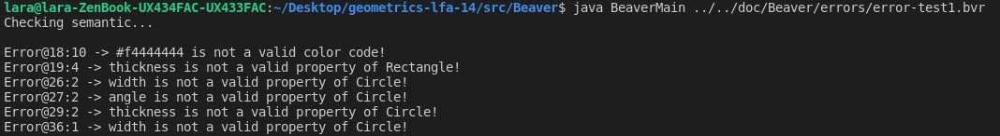
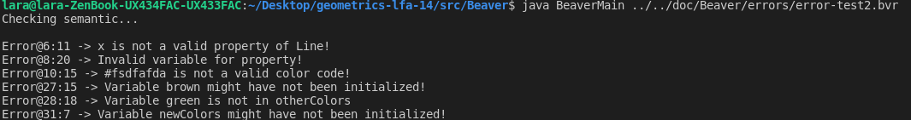

## Membros do Grupo
&nbsp;

| NMec | Name | email | Contribution (%) | Detailed contribution [1]
|:-:|:--|:--|:-:|:--|
| 73150 | Gonçalo Maranhão | goncalo.rodrigues@ua.pt | 15% | primary-grammar (20%) examples (40%) testing (30%)|
| 73211 | Mariana Gomes | marianapinheiro@ua.pt | 15% | primary-grammar (20%) examples (40%) testing (30%)|
| 90327 | Diogo Correia | diogo.correia99@ua.pt | 15% | primary-grammar (20%) examples (40%) testing (30%)|
| 92975 | Leandro Rito | leandro.rito@ua.pt | 15% | primary-grammar (20%) examples (40%) testing (30%)|
| 93427 | Lara Rodrigues| laravieirarodrigues@ua.pt | 15% | primary-grammar (20%) examples (40%) testing (30%)|
| 93460 | João Fernandes | joaogilfernandes@ua.pt | 15% | primary-grammar (20%) examples (40%) testing (30%)|

[1] Topics: 
   gramática principal (%)  análise semântica gramática principal (%)  geração de código  (%)  gramática secundária (%)  análise semântica gramática secundária (%) interpretação/geração de código linguagem secundária (%) exemplos (%) testes(%) relatório (%) 

- Beware that within the group the sum for each topic must be 100% (obviously).

## Material para avaliação

Todo o código presente na master conta para avalição excepto a pasta JavaGraphicsExample e a pasta figure_making que é apenas material de apoio à realização do projeto.

## Compilar e Correr

- Explain how to compile and run language code.

- Preferable option is to provide scripts *compile* and *run*, accepting program filename as argument.

## Exemplos funcionais 

No ponto 1. encontram-se dois exemplos funcionais da linguagem secundária.

1. `geometrics-lfa-14/src/Beaver/working`

    No ficheiro `working-test1.bvr` é criada a figura de um stickman que é constituido por diversas figuras que estão dentro de um container retangular. 
    No ficheiro `flags.bvr` são criadas figuras de duas bandeiras que, assim como no exemplo acima, são constituidas por diversas figuras. 
    Para compilar e correr este exemplo executar o comando :  `java BeaverMain ../../doc/Beaver/working/nome_do_ficheiro`   
    no diretório : `geometrics-lfa-14/src/Beaver/`

No ponto 2. encontam-se x exemplos funcionais da linguagem principal.   

2. `path-to-example`

    Explain what the example does, how it is compiled and run.

...

## Exemplos de erros semânticos

Fizemos análise semântica para as duas linguagens com mensagens personalizadas de erro. No ponto 1. encontram-se os testes para a linguagem secundária e no ponto 2. os testes para a linguagem principal. 
As mensagens de erro vem com a especificação da linha e da coluna onde ocorrem no código. 
Nas imagens que incluimos no relatório são visiveis a maioria das mesagens de erro criadas. 

1. `geometrics-lfa-14/src/Beaver/errors`

    

    Neste exemplo(error-test1.bvr)  são detetados vários erros de semântica relacionados com as figuras. 
    Tal como podemos observar as mensagens de erro indicam especificamente quais foram os erros cometidos. 

    
     
    Este exemplo(error-test2.bvr) testa especificamente erros relacionados com as propriedades de cor.  

2. `path-to-example`
    Neste segundo exemplo são detetados três erros de semântica:
    O primeiro, é um erro 

    

    Explain the detected semantic error and how it is compiled.

## Especificações da linguagem 

1. Palavras reservadas das linguagens: 
`Secundária:` 
containers, Color, Pallete, Rectangle, Number, Figure, Circle, Line, Triangle, Point,  
size,angle,color, border, filled, 
contains, 
startingPoint, endingPoint, center, 
pi,rad, º  
`Principal:`   
use, Color, Board,  
start, end , List, at, Text, set,  
pos,posX,posY,  
Figure, Line, Triangle, Rectangle, Circle,   
display, width, thickness, color, collision, exposed, depth, hidden  
true, false,  
center,  
add, remove,   
draw, write,  
Time, ms,   
Angle, º, deg, pi, rad,   
each, while,  
Task, from, where is, close   

2. Comentários: 
Linguagem secundária: `!!` 
Linguagem principal : `/-`  

